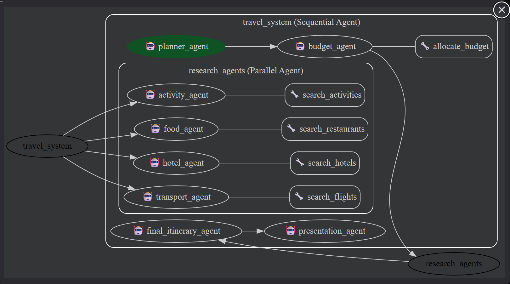

## Conformité aux contraintes du projet

| # | Contrainte | Implémentation dans le projet |
|---|---|---|
| 1 | **Minimum 3 agents** | Le système utilise plusieurs **LlmAgent** avec des rôles distincts : `planner_agent` (extraction des informations de voyage), `budget_agent` (répartition du budget), `transport_agent` (sélection des vols), `hotel_agent`, `food_agent`, `activity_agent`, `final_itinerary_agent`, et `presentation_agent`. |
| 2 | **Au moins 3 tools custom** | Plusieurs **tools Python personnalisés** sont implémentés avec types annotés et docstrings : `allocate_budget`, `search_flights`, `search_hotels`, `search_restaurants`, `search_activities`. |
| 3 | **Au moins 2 Workflow Agents différents** | Le projet utilise deux types de workflow agents : **SequentialAgent** pour l’orchestration principale du système et **ParallelAgent** pour exécuter simultanément les agents de recherche (transport, hôtel, restaurants, activités). |
| 4 | **State partagé** | Les agents communiquent via des **variables partagées avec `output_key`**. Les résultats sont ensuite utilisés dans les instructions des agents suivants via des templates comme `{travel_info}`, `{budget_plan}`, `{flight_option}`, `{hotel_option}`, `{food_plan}` et `{activities}`. |
| 5 | **Les 2 mécanismes de délégation** | Le projet utilise deux formes de délégation : **AgentTool** pour invoquer des tools spécialisés et **transfer_to_agent** pour déléguer complètement certaines tâches entre agents dans le workflow. |
| 6 | **Au moins 2 callbacks** | Deux types de callbacks sont implémentés : `before_agent_callback` (appelé avant l’exécution d’un agent) et `after_tool_callback` (appelé après l’exécution d’un tool). |
| 7 | **Runner programmatique** | Le projet inclut un script `main.py` qui instancie **Runner** et **InMemorySessionService** afin de gérer l’exécution du système multi-agents et les sessions utilisateur. |
| 8 | **Démo fonctionnelle** | Le système peut être exécuté via le script `main.py` ou via le script de test `test_travel_agent.sh`. La démonstration permet d’observer les agents, les appels aux tools et la génération finale d’un itinéraire de voyage. |
### Description du projet et de l’architecture

Ce projet consiste à développer un **système multi-agents de planification de voyage** capable de générer automatiquement une proposition complète d’itinéraire à partir de quelques informations fournies par l’utilisateur.
L’utilisateur doit saisir les éléments suivants : **le lieu de départ, la destination, le nombre de jours de voyage et le budget total**.

Le système est construit avec une **architecture multi-agents hiérarchique**, combinant un **workflow séquentiel (SequentialAgent)** et une **exécution parallèle (ParallelAgent)**. Chaque agent possède une responsabilité spécifique dans le processus de planification.

---

## 1. Collecte et structuration des informations de voyage

Le premier agent, **planner_agent**, analyse la demande de l’utilisateur et extrait les informations essentielles du voyage :

* ville de départ
* destination
* nombre de jours
* budget total

Ces informations sont ensuite structurées sous forme d’un **objet JSON normalisé** appelé `travel_info`. Cette étape permet de transformer la requête utilisateur en données exploitables par les agents suivants.

---

## 2. Répartition du budget

Une fois les informations extraites, le **budget_agent** intervient pour répartir le budget total du voyage en plusieurs catégories principales :

* transport
* hébergement
* restauration
* activités / loisirs

Cette répartition est réalisée à l’aide d’un **outil (tool) appelé `allocate_budget`**.
L’agent appelle cet outil pour calculer la distribution du budget et génère un objet `budget_plan` contenant les montants alloués à chaque catégorie.

---

## 3. Recherche des options de voyage (exécution parallèle)

Après la répartition du budget, plusieurs agents spécialisés travaillent **en parallèle** grâce à un **ParallelAgent**. Chaque agent est responsable d’une catégorie spécifique du voyage.

### Transport Agent

L’agent **transport_agent** utilise le tool `search_flights` pour rechercher des options de vol entre la ville de départ et la destination.
Il sélectionne ensuite le vol le plus adapté, en respectant le budget de transport défini.

### Hotel Agent

L’agent **hotel_agent** utilise le tool `search_hotels` pour récupérer des informations sur les hôtels disponibles à la destination.
Il choisit un hôtel dont le coût total (prix par nuit × nombre de jours) respecte le budget d’hébergement.

### Food Agent

L’agent **food_agent** utilise le tool `search_restaurants` pour obtenir une liste de restaurants.
À partir de ces données, il sélectionne plusieurs restaurants adaptés au séjour.

### Activity Agent

L’agent **activity_agent** utilise le tool `search_activities` pour identifier différentes activités de loisirs disponibles à destination.
Il sélectionne ensuite les activités compatibles avec le budget prévu pour les loisirs.

Les outils utilisés dans cette étape reposent sur des **données simulées (mock data)** représentant des vols, hôtels, restaurants et activités.

Chaque agent renvoie un **objet de sortie structuré** contenant les options sélectionnées.

---

## 4. Génération du plan de voyage final

Les résultats produits par les agents précédents sont ensuite transmis au **final_itinerary_agent**.
Cet agent rassemble toutes les informations :

* données du voyage (`travel_info`)
* répartition du budget (`budget_plan`)
* option de vol
* hôtel sélectionné
* restaurants
* activités

Il génère alors un **plan de voyage structuré** comprenant :

* un résumé du voyage
* les choix effectués pour chaque catégorie
* un itinéraire détaillé du séjour

Toutes ces informations sont regroupées dans un objet JSON `final_plan`.

---

## 5. Présentation du résultat à l’utilisateur

Enfin, le **presentation_agent** transforme les données structurées du plan final en **description en langage naturel**.
L’objectif est de produire une présentation claire et lisible du voyage, incluant :

* un résumé du séjour
* les informations sur le transport
* l’hôtel sélectionné
* les restaurants recommandés
* les activités proposées
* un itinéraire jour par jour

Cette étape permet de rendre le résultat facilement compréhensible pour l’utilisateur final.

---

## 6. Architecture globale du système

L’architecture du système repose sur deux mécanismes principaux :

**Workflow séquentiel (SequentialAgent)**
Les agents sont exécutés dans un ordre logique :

1. planner_agent
2. budget_agent
3. research_agents (agents parallèles)
4. final_itinerary_agent
5. presentation_agent

**Workflow parallèle (ParallelAgent)**
Les agents responsables de la recherche d’options (transport, hôtel, restaurants, activités) sont exécutés simultanément afin d’améliorer l’efficacité du système.

---

## Conclusion

Cette architecture multi-agents permet de **décomposer un problème complexe de planification de voyage en plusieurs tâches spécialisées**.
Chaque agent possède un rôle clair et utilise des outils spécifiques pour accéder aux données nécessaires.

L’utilisation combinée d’un **workflow séquentiel et parallèle** permet de construire un système modulaire, extensible et capable de générer automatiquement des propositions de voyage cohérentes tout en respectant le budget défini par l’utilisateur.


## Téléchargement du projet

Le code source du projet est disponible sur GitHub :

```bash

https://github.com/Boyuzhang333/agent-for-travel.git

```

### 1. Cloner le dépôt
```bash
git clone https://github.com/Boyuzhang333/agent-for-travel.git
```
### 2. Accéder au dossier du projet
```bash
cd agent-for-travel
```
### 3. Créer un environnement virtuel
```bash
python -m venv .venv
```
### 4. Activer l’environnement virtuel
```bash
.venv\Scripts\activate
```
### 5. Installer les dépendances
```bash
pip install -r requirements.txt
```

## Lancement le test et le demo
Afin de faciliter la vérification du système, un script Bash de test a été mis en place. Ce script permet d’exécuter automatiquement plusieurs scénarios de test et d’observer le fonctionnement du système multi-agents.

Le script lance le programme principal et simule différentes requêtes utilisateur contenant les informations nécessaires à la planification d’un voyage : ville de départ, destination, durée du voyage et budget.

Pour exécuter les tests et réaliser la démonstration du système, il suffit simplement de lancer le script Bash suivant :

```bash
bash test_travel_agent.sh
```
Lors de l’exécution, le script envoie automatiquement plusieurs requêtes au système et affiche dans le terminal :

les agents activés dans le workflow

les appels aux tools

les résultats générés par chaque agent

la proposition finale d’itinéraire de voyage

Cela permet d’observer clairement le fonctionnement de l’architecture multi-agents et de vérifier que chaque composant du système fonctionne correctement.

Le script contient plusieurs cas de test représentatifs, par exemple :

Planification d’un voyage court avec un budget limité

Planification d’un séjour plus long avec un budget plus élevé

Différentes combinaisons de villes de départ et de destinations

Grâce à ce script, la démonstration du système peut être réalisée de manière simple et reproductible, en exécutant une seule commande.


