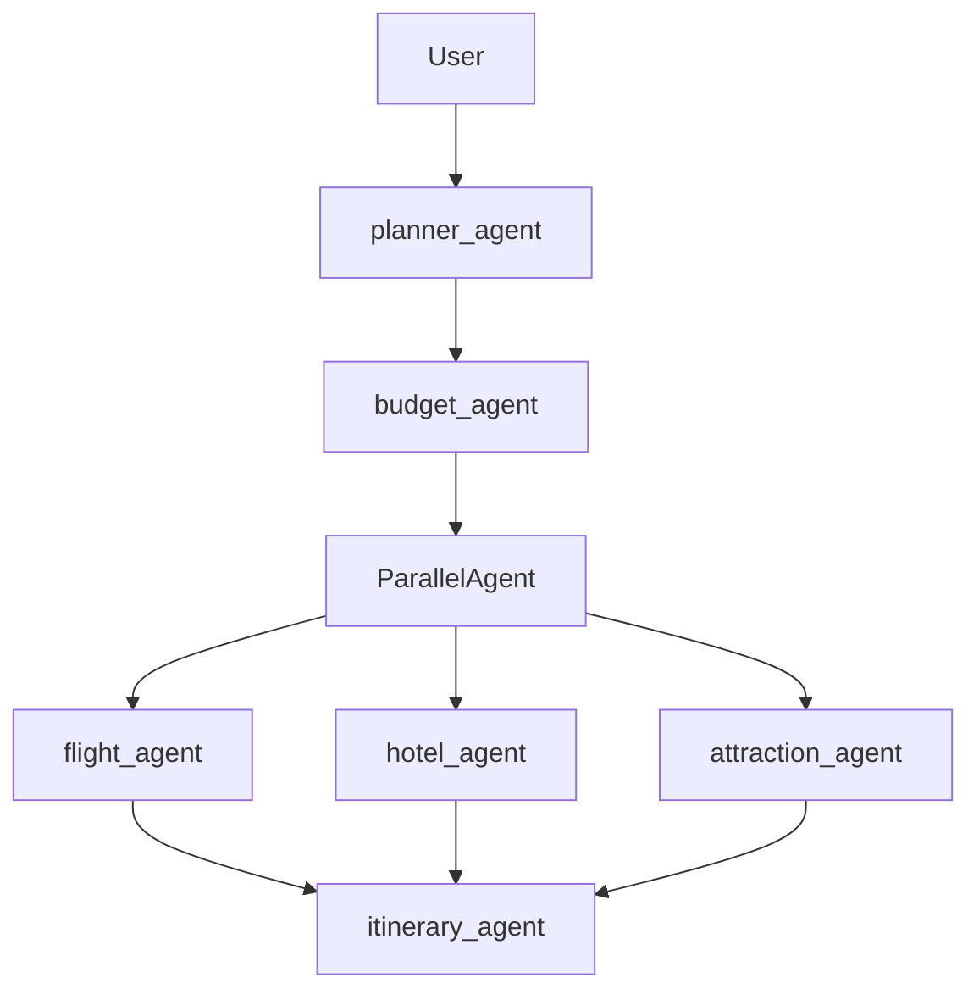
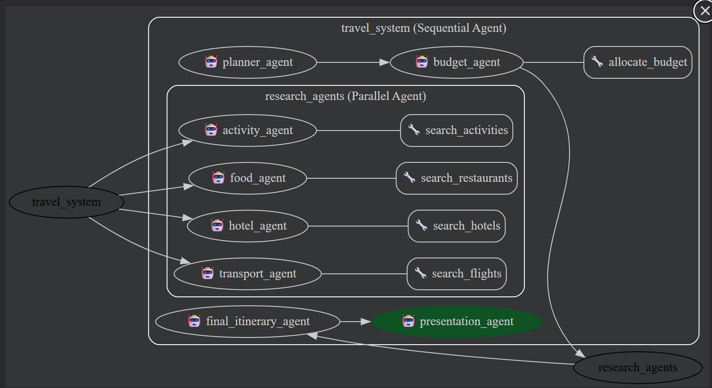
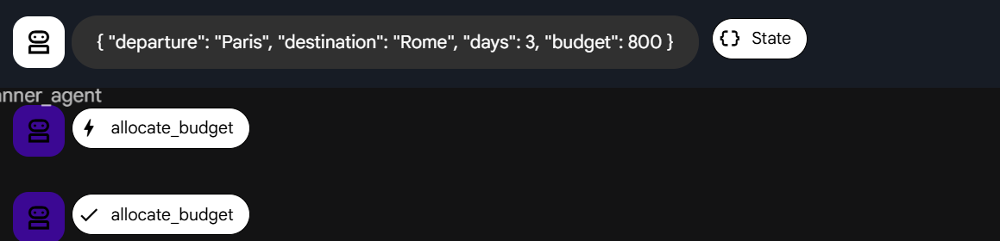
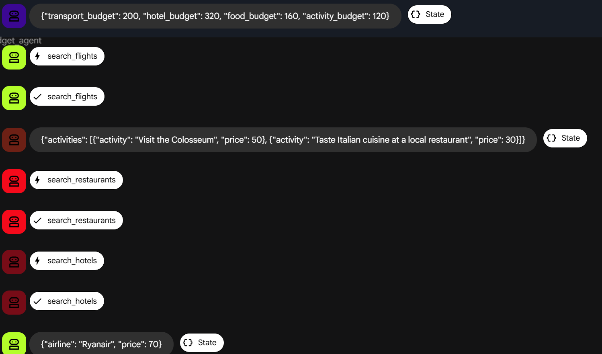
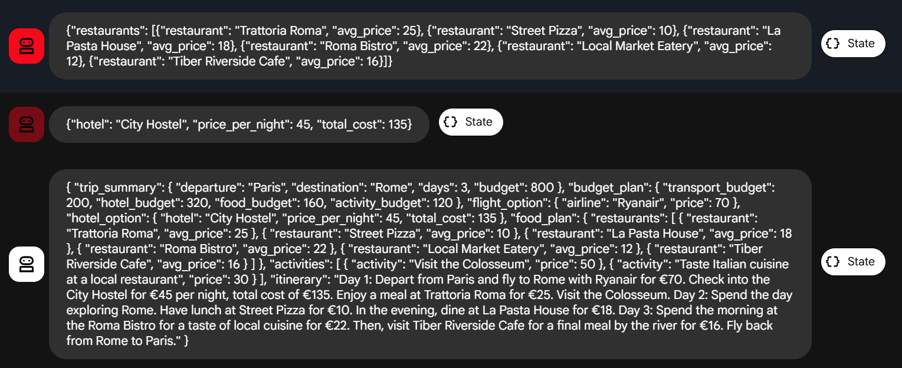
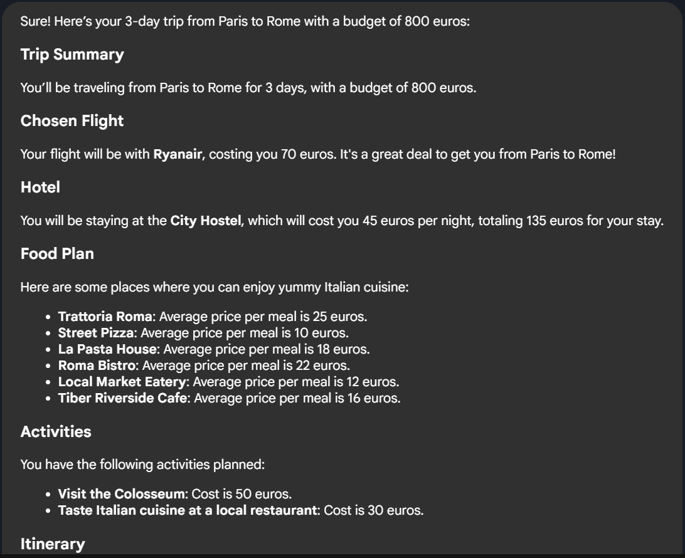
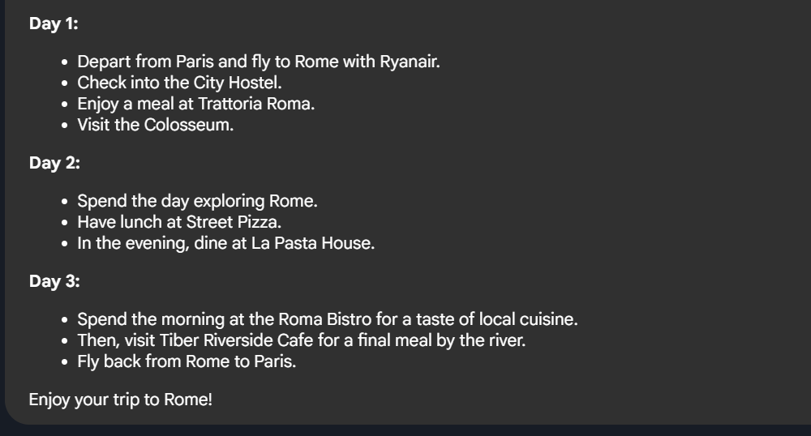

L’utilisateur saisit : **lieu de départ, destination, nombre de jours de voyage et budget**.

1. **Répartition du budget**
   Le système commence par répartir le budget total selon plusieurs catégories logiques :

   * **Transport**
   * **Hébergement**
   * **Restauration**
   * **Activités / loisirs**

   Cette répartition dépend de plusieurs facteurs :

   * le nombre de jours du voyage
   * la destination
   * le budget total

2. **Sélection des options par catégorie**
   Pour chaque catégorie, un **agent spécialisé** reçoit la part de budget correspondante et doit choisir les options les plus adaptées.

   Chaque agent utilise des **tools avec des données simulées (mock data)**, par exemple :

   * informations sur les **hôtels**
   * informations sur les **vols**
   * informations sur les **restaurants**
   * informations sur les **activités de loisirs**

   À partir de ces données, chaque agent sélectionne les options qui respectent le budget attribué.

3. **Retour des résultats par agent**
   Chaque agent renvoie un **objet de réponse** contenant les éléments sélectionnés pour sa catégorie (transport, hébergement, restauration ou activités).

4. **Synthèse finale**
   Un **agent final** récupère les réponses de tous les agents et les **combine pour générer une proposition complète d’itinéraire de voyage**, incluant transport, logement, repas et activités, tout en respectant le budget global.

加上部署方面

callback 方面

考虑生产和开发的平衡

